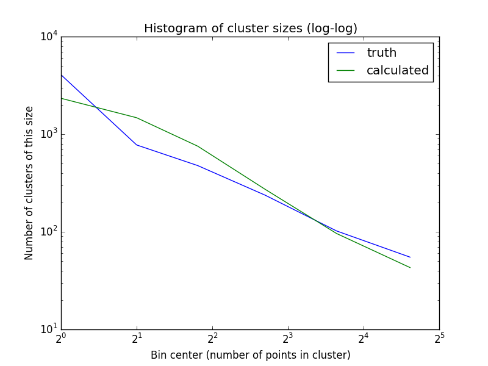

# Waldo Photos Data Engineering Exercise
## Problem
Cluster a dataset of 13,199 vectors (of length 4096) into groups of similar characteristics. The data are feature vectors extracted from face images. Each cluster in the result should ideally represent the face of one individual and include all images of that individual's face. The ground truth is given in the original data set.

## Approach
Because the number of clusters is very large and unknown, an unmodified K-means algorithm is unsuitable because it requires the number of clusters to be specified. This led to experimentation using hierarchical clustering.

## Implementation
**Hierarchical clustering** of the data was performed using the scipy Python library's hierarchical clustering tools, in particular `fclusterdata` in the package `scipy.cluster.hierarchy`. The criterion for forming clusters was 'distance', the metric used was 'euclidean' and the linkage method was 'average'.
### Options
**'distance'** means that the threshold value given is the maximum "cophenetic" distance objects in a single cluster may have. Larger values mean bigger clusters. Other criteria besides this one were not explored extensively. Cursory experimentation revealed the others led to implementation issues on our data set.

**'euclidean'** means that the distance measurement used was the L2 norm or Euclidean distance. This is a conventional choice and strongly suggested by the problem statement document. Several others were tried out of curiosity but did not reveal any surprises. Other choices may be computationally less expensive however.

**'average'** means that the overall distance between two clusters is computed as an average distance (as opposed to a 'nearest point' or 'farthest point' algorithm, for example). This is also computationally more expensive than some alternatives. The nearest point algorithm in particular is much faster. The 'average' option seems clearly to provide the best performance given the other options specified.

### Threshold selection
The threshold value selection is a contentious issue since there is no good way to do it other than trial-and-error. For this project I took a subset of the data (names starting with "A", "J", "M" and "R") and ran the algorithm with various thresholds, calculating the F-score (defined in the *Results* section below) and iterating until finding the threshold that gave the highest F-score. For the options listed above, that value was 1.10.

## Results
### Histogram comparison
One way to evaluate the results of the clustering is to compare the histogram of the cluster sizes between the truth and the clustering result. As you can see in the results below, at the chosen threshold there are significantly fewer single-member clusters than in the ground truth, and significantly more clusters with 2-4 members. Clusters of larger sizes were very close in number.

### Precision and recall
Precision and recall are used to characterize the performance of clustering algorithms. In this case I am using "pairwise" measurements as defined in Otto, Wang and Jain [1]. Pairwise precision is the number of pairs in each cluster that are of the same ground truth class, divided by the total number of pairs in each cluster for all clusters. Singleton clusters are considered a valid pair for both cases. Pairwise recall is the total number of pairs of the same ground truth class that are within a single cluster, divided by the total number of pairs in each ground truth class for all classes. The harmonic mean of precision and recall is called the F-score (F1-score or F-measure) and is a measure of the overall accuracy of the clustering.

Alternatively, precision is TP / (TP + FP) and recall is TP / (TP + FN).

For a threshold value of 1.10 used on the entire data set with the options described above, I calculated the following results:

| **Precision** | **0.960** |
| ------------- | --------- |
| **Recall**    | **0.784** |
| **F-score**   | **0.863** |

This compares favorably to the results of Otto, Wang and Jain [1] who report an F-score on the LFW data set of 0.87 using their proposed "approximate rank order" agglomerative hierarchical clustering algorithm. Their algorithm is reputed to be very fast, however, whereas the algorithm I used is quite slow (35 minutes on a 2011 MacBook Pro).

A **Precision-recall curve** (similar to an ROC curve) is made by plotting precision vs recall for various threshold values. An example precision-recall curve built using thresholds from 0.6 to 1.6 for a subset of the data (names starting with "A", "J" and "M") is shown below. The F-score is also plotted (against recall) on the same graph.

## References
1. Otto, Charles, Dayong Wang, and Anil K. Jain. "Clustering millions of faces by identity." arXiv preprint arXiv:1604.00989 (2016).
2. Labeled Faces in the Wild, <http://vis-www.cs.umass.edu/lfw/index.html>
3. Duda, R.O. and P.E. Hart. *Pattern Classification and Scene Analysis*. Wiley (1973).

